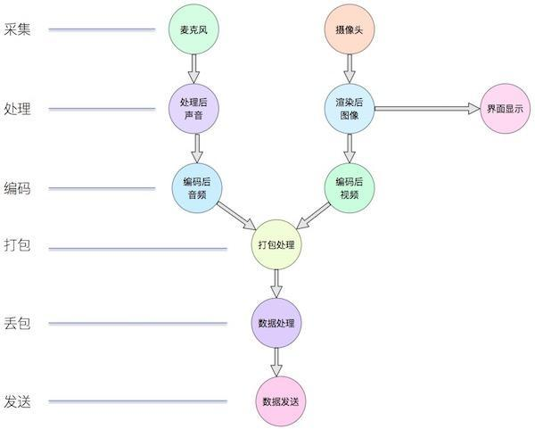

## SopCastSDK

fork [https://github.com/LaiFeng-Android/SopCastComponent](https://github.com/LaiFeng-Android/SopCastComponent "https://github.com/LaiFeng-Android/SopCastComponent")



### 支持功能
>* 硬编码
>* 弱网络环境处理
>* 动态码率调整
>* 摄像头参数设置
>* 音频参数设置
>* 视频参数设置
>* 支持不同窗口尺寸
>* 支持基于Gpu的视频特处理
>* 支持静音
>* 支持rtmp上传
>* 支持水印
>* 支持截屏录制
>* 支持摄像头切换
>* 支持flv封包
>* 支持摄像头自动对焦和手动对焦切换
>* 支持摄像头缩放
>* 支持闪光灯操作
>* 支持音频回声消除

### 要求

>* 摄像头相关操作: Android sdk 版本 14+
>* 视频直播: Android sdk 版本 18+

### 如何使用

#### 1. 下载
使用起来非常方便, Gradle:
```
compile 'com.laifeng:sopcast-sdk:1.0.4'
```
#### 2. 权限
在使用前需要添加相应的权限:

```
<uses-permission android:name="android.permission.CAMERA" />
<uses-permission android:name="android.permission.FLASHLIGHT" />
<uses-permission android:name="android.permission.CAMERA" />

<uses-permission android:name="android.permission.WRITE_EXTERNAL_STORAGE"/>
<uses-permission android:name="android.permission.RECORD_AUDIO"/>
<uses-permission android:name="android.permission.MODIFY_AUDIO_SETTINGS" />

<uses-permission android:name="android.permission.WAKE_LOCK" />
<uses-permission android:name="android.permission.INTERNET" />

<uses-feature android:name="android.hardware.camera" />
<uses-feature android:name="android.hardware.autofocus" />
```

**注意：** 在Android 6.0以后很多权限需要动态申请. 如果你想快速使用，可以将项目的targetSdkVersion设置在23一下。

#### 3. 预览窗口大小
CameraLivingView支持View固定大小（EXACTLY）的模式，当然也可以在xml中定义窗口的长宽比，
这样的话一个参数要设为固定大小，另外一个参数设为"wrap_content"。
参考代码如下：

```
<com.laifeng.sopcastsdk.ui.CameraLivingView
    android:id="@+id/liveView"
    android:layout_width="match_parent"
    android:layout_height="wrap_content"
    app:aspect_ratio="0.8"/>
```

#### 4. 摄像头参数设置

```
CameraConfiguration.Builder cameraBuilder = new CameraConfiguration.Builder();
cameraBuilder.setOrientation(CameraConfiguration.Orientation.LANDSCAPE)
        .setFacing(CameraConfiguration.Facing.BACK).setPreview(720, 1280)
        .setFps(24).setFocusMode(CameraConfiguration.FocusMode.TOUCH);
CameraConfiguration cameraConfiguration = cameraBuilder.build();
mLFLiveView.setCameraConfiguration(cameraConfiguration);
```
在Activity的onCreate方法中设置摄像头参数信息，那么摄像头就会按照你的设置进行打开。如果你在横屏界面，需要将摄像头设置为横屏模式。
你可以传入一个摄像头预览尺寸的大小，内部会找出和这个设置的大小最匹配的尺寸进行使用。如果摄像头预览大小和屏幕显示大小不一致，则会先泽中间部分进行缩放显示。
如果你使用默认的设置的话，则不需要进行任何设置。**很多手机前置摄像头需要设置fps为15，否则在弱光下会很黑。**

默认设置如下:
```
public static final int DEFAULT_HEIGHT = 1280;
public static final int DEFAULT_WIDTH = 720;
public static final int DEFAULT_FPS = 15;
public static final Facing DEFAULT_FACING = Facing.FRONT;
public static final Orientation DEFAULT_ORIENTATION = Orientation.PORTRAIT;
public static final FocusMode DEFAULT_FOCUSMODE = FocusMode.AUTO;
```

#### 5. 视频参数设置
```
VideoConfiguration.Builder videoBuilder = new VideoConfiguration.Builder();
videoBuilder.setSize(640, 360).setMime(DEFAULT_MIME)
        .setFps(15).setBps(300, 800).setIfi(2);
mVideoConfiguration = videoBuilder.build();
mLFLiveView.setVideoConfiguration(mVideoConfiguration);
```
在直播之前可以进行视频参数设置，可以通过setSize()方法来设置视频输出的尺寸大小，如果设置的尺寸比例不符合预览尺寸比例，则会选择中间区域进行缩放输出。
在直播之前可以设置视频的最大和最小码率，直播的时候先使用最大码率，后来根据网络环境进行调整，但是码率始终在最大和最小码率之间。mime参数将会设置到硬编
编码器，请确保mime的正确性，ifi参数也会传递到硬编编码器。如果你使用默认参数，则不需要进行任何设置。

默认设置如下：
```
public static final int DEFAULT_HEIGHT = 640;
public static final int DEFAULT_WIDTH = 360;
public static final int DEFAULT_FPS = 15;
public static final int DEFAULT_MAX_BPS = 1300;
public static final int DEFAULT_MIN_BPS = 400;
public static final int DEFAULT_IFI = 2;
public static final String DEFAULT_MIME = "video/avc";
```

#### 6. 音频参数设置
```
AudioConfiguration.Builder audioBuilder = new AudioConfiguration.Builder();
audioBuilder.setAec(true).setBps(32, 64).setFrequency(16000).setMime(DEFAULT_MIME).
        setAacProfile(DEFAULT_AAC_PROFILE).setAdts(DEFAULT_ADTS).
        setChannelCount(1).setEncoding(DEFAULT_AUDIO_ENCODING);
AudioConfiguration audioConfiguration = audioBuilder.build();
mLFLiveView.setAudioConfiguration(audioConfiguration);
```
通过'setAec(true)'方法可以打开回声消除功能，回声消除功能仅仅在(8000, 16000)采样率并且单声道下支持。
mime参数将会设置到硬编编码器，请使用正确的mime参数。如果使用默认参数，则不需要进行任何设置。

默认设置如下：
```
public static final int DEFAULT_FREQUENCY = 44100;
public static final int DEFAULT_MAX_BPS = 64;
public static final int DEFAULT_MIN_BPS = 32;
public static final int DEFAULT_ADTS = 0;
public static final String DEFAULT_MIME = "audio/mp4a-latm";
public static final int DEFAULT_AUDIO_ENCODING = AudioFormat.ENCODING_PCM_16BIT;
public static final int DEFAULT_AAC_PROFILE = MediaCodecInfo.CodecProfileLevel.AACObjectLC;
public static final int DEFAULT_CHANNEL_COUNT = 1;
public static final boolean DEFAULT_AEC = false;
```

#### 7. 设置打包器
```
RtmpPacker packer = new RtmpPacker();
packer.initAudioParams(AudioConfiguration.DEFAULT_FREQUENCY, 16, false);
mLFLiveView.setPacker(packer);
```
我们内部提供了flv和rtmp的打包器，你也可以定义自己的打包器。打包器负责将硬编后的视音频进行打包，然后传递给发送者进行发送。

#### 8. 设置发送器
```
String url = "rtmp://[host]:1935/[app]/[stream]";
mRtmpSender = new RtmpSender(url);
mRtmpSender.setVideoParams(640, 360);
mRtmpSender.setAudioParams(AudioConfiguration.DEFAULT_FREQUENCY, 16, false);
mRtmpSender.setSenderListener(mSenderListener);
mLFLiveView.setSender(mRtmpSender);
```
我们提供了本地和rtmp的发送器，本地发送器就是保持文件到本地，你也可以定义自己的发送器。

#### 9. 视频特效
原来的版本只提供了无特效,灰色两种特效，我在这里添加了美颜特效。
```
mLFLiveView.setEffect(mGrayEffect);
```
#### 10. 水印
在这往视频上添加水印也非常方便，设置水印后预览和输出都会显示相应尺寸的水印。设置水印的大小和位置是居于输出视频的，
预览界面会根据输出视频的情况等比例显示水印。请设置视频水印的长宽比和水印图片的长宽比一致。
```
Bitmap watermarkImg = BitmapFactory.decodeResource(getResources(), R.mipmap.watermark);
Watermark watermark = new Watermark(watermarkImg, 50, 25, WatermarkPosition.WATERMARK_ORIENTATION_BOTTOM_RIGHT, 8, 8);
mLFLiveView.setWatermark(watermark);
```

#### 11. CameraListener
设置一个摄像头监听器，这样的话会受到摄像头的回调。
```
//设置预览监听
mLFLiveView.setCameraOpenListener(new CameraListener() {
    @Override
    public void onOpenSuccess() {
        Toast.makeText(LandscapeActivity.this, "Camera open success", Toast.LENGTH_LONG).show();
    }

    @Override
    public void onOpenFail(int error) {
        Toast.makeText(LandscapeActivity.this, "Camera open fail", Toast.LENGTH_LONG).show();
    }

    @Override
    public void onCameraChange() {
        Toast.makeText(LandscapeActivity.this, "Camera switch", Toast.LENGTH_LONG).show();
    }
});
```

#### 12. LivingStartListener
设置直播开始的监听器，这样的话会收到开播的相关监听。
```
mLFLiveView.setLivingStartListener(new CameraLivingView.LivingStartListener() {
    @Override
    public void startError(int error) {
        Toast.makeText(LandscapeActivity.this, "Start fail", Toast.LENGTH_SHORT).show();
        mLFLiveView.stop();
    }

    @Override
    public void startSuccess() {
        Toast.makeText(LandscapeActivity.this, "Start success", Toast.LENGTH_SHORT).show();
    }
});
```
The errors:
```
public static final int NO_ERROR = 0;
public static final int VIDEO_TYPE_ERROR = 1;
public static final int AUDIO_TYPE_ERROR = 2;
public static final int VIDEO_CONFIGURATION_ERROR = 3;
public static final int AUDIO_CONFIGURATION_ERROR = 4;
public static final int CAMERA_ERROR = 5;
public static final int AUDIO_ERROR = 6;
public static final int AUDIO_AEC_ERROR = 7;
public static final int SDK_VERSION_ERROR = 8;
```
## License
 **SopCastComponent is released under the BSD license. See LICENSE for details.**


